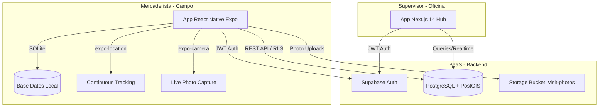
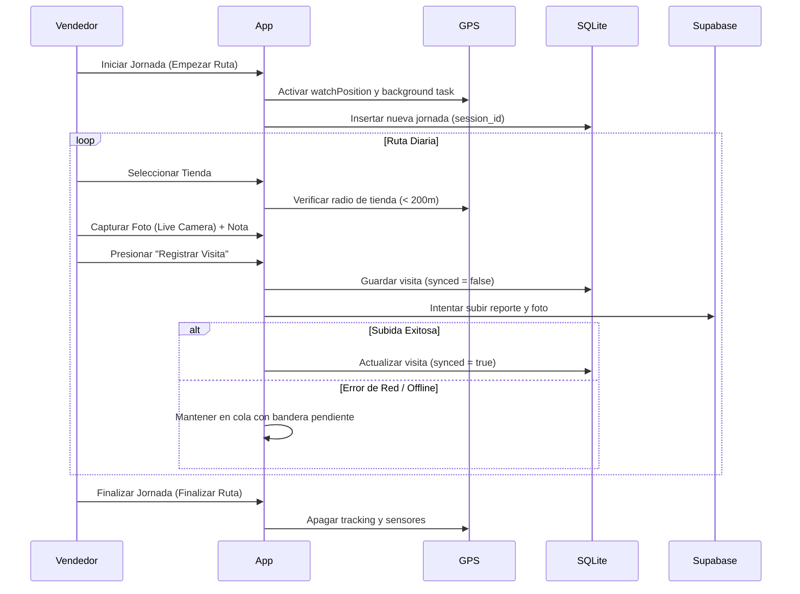

# Arquitectura General — Ponzivenzo Smart Tracker

La plataforma se compone de dos aplicaciones independientes (frontend web y cliente móvil nativo) que interactúan a través de los servicios en la nube de **Supabase**.

---

## 💻 El Panel de Supervisión (`hub/`)

* **Framework:** Next.js 14 con App Router y TypeScript.
- **Propósito:** Actúa como el centro de control y visualización de la operación en campo. Es una interfaz responsiva optimizada para pantallas de escritorio.
- **Rutas Principales:**
  - `/supervisor` — Dashboard con gráficos acumulados de visitas de la jornada.
  - `/supervisor/contactos` — Listado de clientes y tiendas. Permite editar y ver detalles de visitas realizadas y programadas.
  - `/supervisor/tareas` — Panel interactivo estilo Kanban/Lista para delegar tareas y revisar sus resoluciones.
  - `/supervisor/mapa` — Visualización geográfica de recorridos y mapa de calor.

---

## 📱 La Aplicación Móvil (`mobile/`)

- **Framework:** React Native con Expo SDK 54.
- **Propósito:** Herramienta de trabajo del mercaderista de campo que prioriza el registro de actividades rápidas y la robustez offline.
- **Componentes de Navegación (`src/navigation/`):**
  - **AuthStack:** Control de acceso (`LoginScreen`).
  - **MainTabs (Bottom Tab Navigation):**
    - 🗺️ **Ruta (`RouteScreen`):** Lista de las tiendas a visitar en el día y estado de cada una.
    - 📋 **Historial (`VisitHistoryScreen`):** Reportes completados durante el día.
    - 👤 **Perfil (`ProfileScreen`):** Datos del vendedor, métricas de rendimiento y cierre de sesión.

### Flujo Operativo en Campo

---

## Enlaces Relacionados
- [[resumen/Resumen General|Resumen General]] — Visión global del negocio.
- [[Esquema Base Datos]] — Detalles de tablas y RLS.
- [[01_session_lifecycle]] — Detalle de la máquina de estados de las sesiones.
- [[03_offline_sync]] — Lógica del motor de sincronización.
